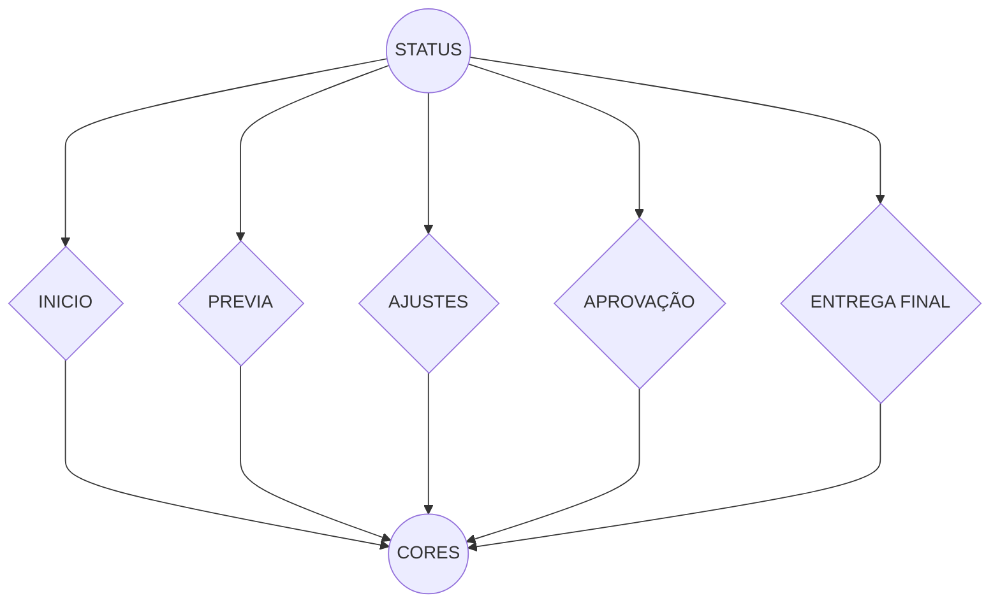
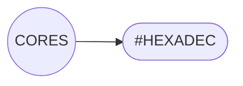
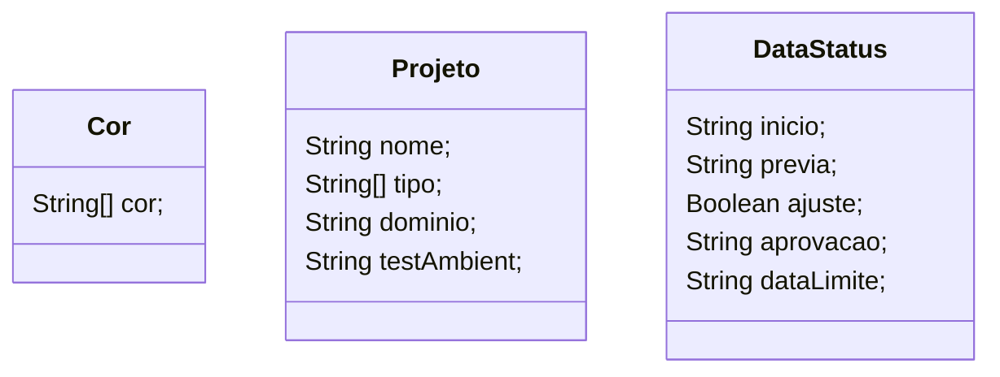

### CSP - Controlador de Status de Projetos, Simples e Prático

#### Estória de usuário:
Elaboração de um projeto para gerenciamento de projetos.
Neste projeto é possível adicionar diferentes tipos de projetos.
Hoje a empresa conta com dois tipos de projetos, sendo eles: _Criação de OnePage/Landing Pages "wordpress"_ e _Criação de Lojas virtuais "webstore"_.
É possível visualizar em que estado o projeto se encontra, e as informações deste projeto.
>Exemplo: [NC/P] - [LD] - [LPR] - [Outas informações]

##### Informações relevantes de projetos a serem exibidos:

- Nome do cliente ou Nome do projeto.
- Link de domínio.
- Link provisório/Ambiente de testes.
- Data de início do projeto.
- Data de envio da prévia "_Link provisório_" para o cliente.
- Data de retorno do cliente.
- Ajustes 
- Data aprovação cliente.
- Data de entrega final do projeto.
- Data termino período últimos ajustes.

Dependendo da faze que o período se encontra, podemos colocar algumas cores para fácil entendimento.

Precisa ter uma separação dos tipos de projeto, One Page e Loja.

## Requisitos do projeto.
- #### Projeto:
- - Nome projeto: **[tipo texto]**
- - Tipo projeto: **[tipo texto]**
- - Link de domínio **[tipo de texto]**
- - Link do ambiente de testes: **[tipo de texto]**
- #### Datas:
- - Inicio: **[tipo data]**
- - Envio prévia: **[tipo data]**
- - Retorno cliente: **[tipo data]**
- - Ajustes: **[tipo booliano]**
- - Aprovação: **[tipo data]**
- - Entrega final: **[tipo data]**
- - Período de ajustes finais: **[tipo data 15 dias futuro]**
- #### Cores:
- - Cinco variações cores: **[tipo texto]** 

#

